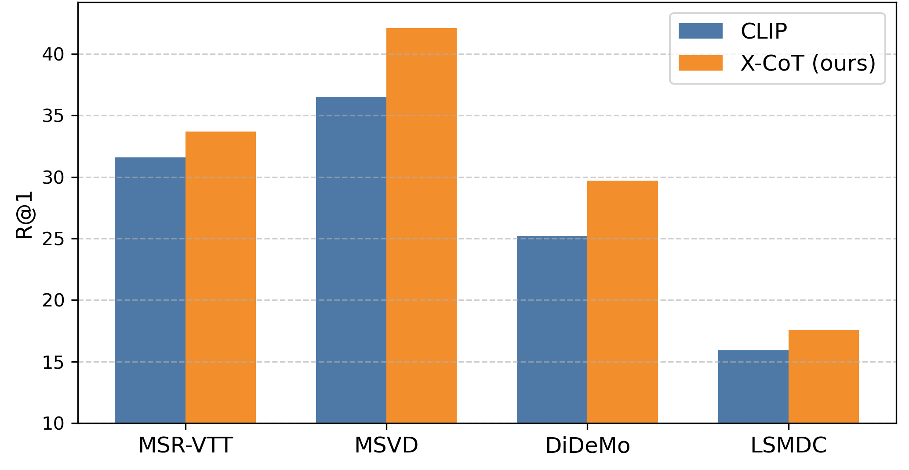
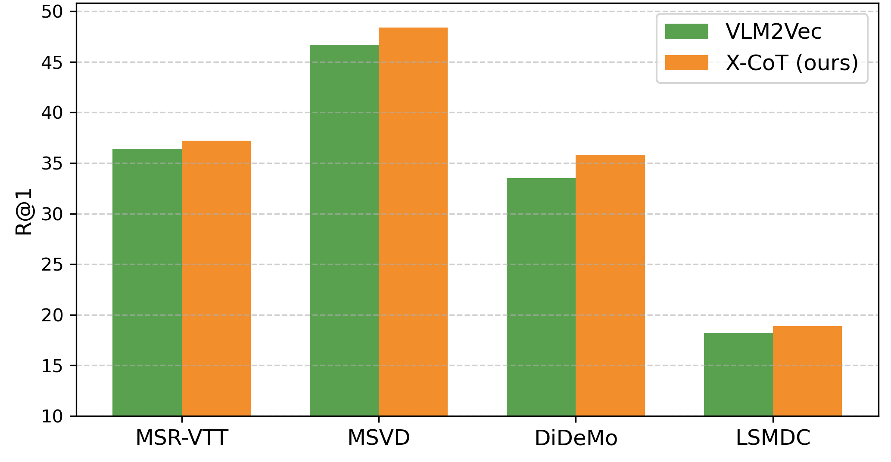
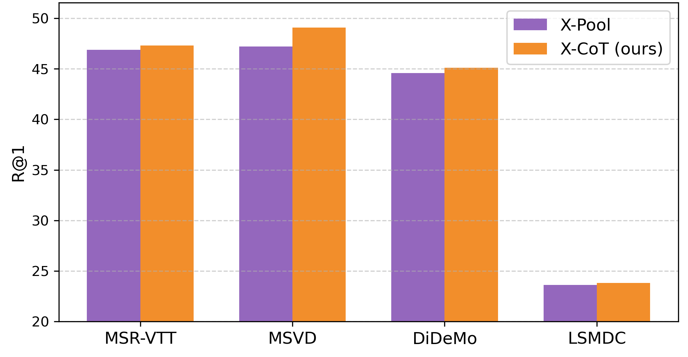

# <p align="center">X-CoT: Explainable Text-to-Video Retrieval via LLM-based Chain-of-Thought Reasoning</p>

<p align="center">
  <a href="https://prasannapulakurthi.github.io/X-CoT/"></a>
  <a href="https://aclanthology.org/2025.emnlp-main.1588/"></a>
  <a href="https://huggingface.co/datasets/prasannareddyp/X-CoT"></a>
  <a href="LICENSE"></a>
</p>

This is the official code for the **EMNLP 2025** paper "**X-CoT: Explainable Text-to-Video Retrieval via LLM-based Chain-of-Thought Reasoning**"
by [Prasanna Reddy Pulakurthi](https://www.prasannapulakurthi.com/), [Jiamian Wang](https://jiamian-wang.github.io/), [Majid Rabbani](https://www.rit.edu/directory/mxreee-majid-rabbani), [Sohail Dianat](https://www.rit.edu/directory/sadeee-sohail-dianat), [Raghuveer Rao](https://ieeexplore.ieee.org/author/37281258600), and [Zhiqiang Tao](https://ztao.cc/index.html). 


## Overview
X‑CoT (Explainable Chain‑of‑Thought reranking) takes as input:
- Initial retrieval results (top‑K retrieved video indices).
- Video breakdowns JSONL (summaries, objects, actions, scene tags, frame captions per video).

It then prompts an LLM to compare pairs of candidate videos against the query, using the breakdowns for grounded, interpretable signals. The pairwise outcomes are aggregated via a lightweight sorting and Bradley‑Terry fit to produce a re‑ranked list with improved recall.


## Quick Start

**Run in Google Colab**

[](https://colab.research.google.com/github/PrasannaPulakurthi/X-CoT/blob/main/colab_notebooks/XCoT.ipynb)


## Local Setup

## Step 1: Obtain Initial Retriever Results

### Option 1

Download the provided initial retrieval results from the [[Hugging Face]](https://huggingface.co/datasets/prasannareddyp/X-CoT/tree/main) link and place them at: `outputs/<dataset>/<method>_ranking_<mode>.jsonl`

### Option 2

**Prepare Datasets:**
- To download the MSRVTT, MSVD, LSMDC, and DiDeMo datasets, please refer to [[CLIP4Clip repo]](https://github.com/ArrowLuo/CLIP4Clip).
- Once downloaded, provide the videos directory via `--videos_dir` when generating initial retrievals.

**Dependencies:**
- To run Clip and Xpool, please take a look at the [[XPool repo]](https://github.com/layer6ai-labs/xpool) for the dependencies. 
- To run VLM2Vec, refer to the [[VLM2Vec repo]](https://github.com/TIGER-AI-Lab/VLM2Vec) for the dependencies. 

**Run the initial retrievers:**
See `initial_retrievers_cmds.sh` for examples of CLI commands.

    python xpool_ranking.py --test_mode=benchmark --exp_name=MSRVTT --videos_dir=data/MSRVTT/videos/all --batch_size=32 --huggingface --load_epoch=-1 --dataset_name=MSRVTT --retrieve_topk --topk=20 --topk_retrieval_method=xpool

- The pretrained X-Pool weights are automatically downloaded from [[Google Drive]](https://drive.google.com/drive/folders/1IKqxZh--MatU_UdKV99FZAVrbaK7J00M?usp=sharing) and placed in `outputs/<dataset>/model_best.pth`
- Initial retriever results will be saved in `outputs/<dataset>/<method>_ranking_<mode>.jsonl`.


## Step 2: Install Dependencies to Run X-CoT
1. Clone this repository.
    ~~~
    git clone https://github.com/PrasannaPulakurthi/X-CoT.git
    cd X-CoT
    ~~~

2. Python 3.9+, CUDA‑enabled, PyTorch (GPU): https://pytorch.org/get-started/locally/
    
   Example (CUDA 12.x): pip install torch --index-url https://download.pytorch.org/whl/cu121

3. Install additional packages to run X‑CoT using the following command.
    ~~~
    pip install -r requirements.txt
    ~~~


## Step 3: Run X-CoT

1. Obtain video breakdowns.
   - Download the provided JSONL files from the [[Hugging Face]](https://huggingface.co/datasets/prasannareddyp/X-CoT/tree/main) link above and place them at: `outputs/<dataset>/video_breakdowns_<mode>.jsonl`

2. Make sure to have the initial retriever results at `outputs/<dataset>/<method>_ranking_<mode>.jsonl` by following [Step 1](#step-1-obtain-initial-retriever-results).

3. Run X‑CoT reranking.
    ~~~
    python xcot.py --exp_name=MSRVTT --dataset_name=MSRVTT --topk=20 --topk_retrieval_method=xpool
    ~~~
This reads the initial rankings and breakdowns, queries the LLM (default: `Qwen/Qwen2.5-7B-Instruct-1M`), and logs recall metrics. Logs are written under `logs/<exp_name>/<timestamp>/`. See `xcot_cmds.sh` for the full list of CLI commands.

## Results

| X-CoT vs CLIP (R@1) | X-CoT vs VLM2Vec (R@1) | X-CoT vs X-Pool (R@1) |
| :---: | :---: | :---: |
| |  |  |


## Citation
If you find this work valuable for your research, we kindly request that you cite the following paper:

```
@inproceedings{pulakurthi2025x,
  title={X-CoT: Explainable Text-to-Video Retrieval via LLM-based Chain-of-Thought Reasoning},
  author={Pulakurthi, Prasanna Reddy and Wang, Jiamian and Rabbani, Majid and Dianat, Sohail and Rao, Raghuveer and Tao, Zhiqiang},
  booktitle={Proceedings of the 2025 Conference on Empirical Methods in Natural Language Processing},
  pages={31172--31183},
  year={2025}
}
```


## Acknowledgements
- [XPool](https://github.com/layer6ai-labs/xpool) 
- [VLM2Vec](https://github.com/TIGER-AI-Lab/VLM2Vec) 

